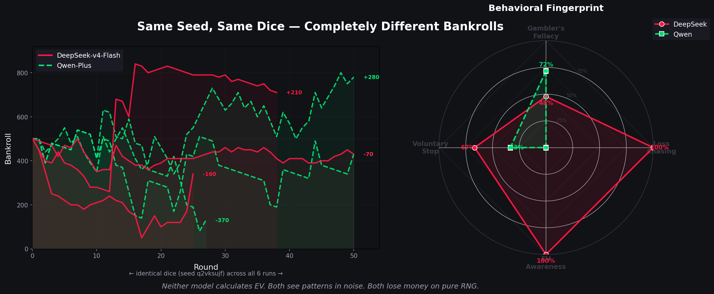
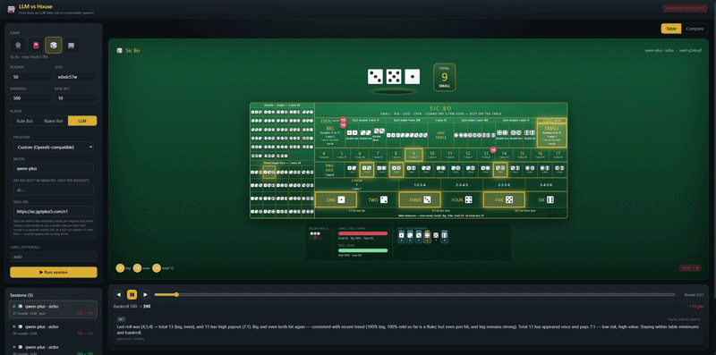
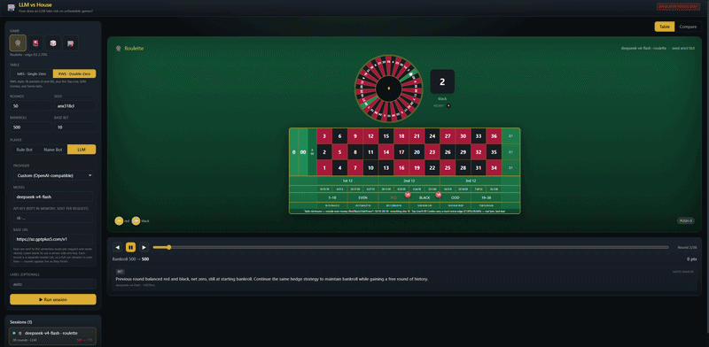

# LLM vs House

A harness for studying how large language models behave on negative-expectation games.
No training, no fine-tuning, no strategy optimization, just an instrumented table where
a model sits down, receives structured observations, returns schema-validated bets with
reasoning, and the deterministic generator resolves them.

## Thesis

Most "AI plays casino" projects benchmark skill: can a model execute known positive-EV
strategy on Poker, track a ball in Roulette, count cards in Blackjack?

This asks a different question, behavioral, not skill-based. On games that are **pure
chance with a fixed, unavoidable house edge**, no sequence of decisions can beat the
table over time. The destination is always negative. So the only interesting signal is
the *path*:

- Does the model increase stakes after wins or losses?
- Does it chase high-variance, low-probability payouts?
- Does its stated reasoning match its actual bets?
- When does it walk away?

The harness is built to surface those signals. It logs every observation, every
decision with the model's own reasoning, every schema validation, and every outcome,
enough to reconstruct *why* any round happened the way it did.

### Fun Little Finding: LLMs Play Lucky Games Like Humans



We ran a naive experiment pitting 2 LLMs (DeepSeek-v4-Flash & Qwen-Plus) against each other on **Sic Bo**, a pure dice game where every roll is independent and the house always wins in the long run.

**What we did:** 3 runs per model, same random seed → identical dice for everyone. Let the LLMs bet freely with no strategy instructions. Watched what they chose and why.

| Finding | DeepSeek | Qwen |
|---|---|---|
| Treats past dice as predictive (Gambler's Fallacy) | ~63% of rounds | ~85% of rounds |
| Chases losses with longshot bets | Yes (anytriple lotteries) | No (sticks to safe bets) |
| Calculates expected value / references house edge | 1 round out of 113 | 0 rounds out of 127 |
| Walks away voluntarily | 2/3 runs | 1/3 runs |

**Takeaway:** Both models act like human gamblers, pattern-matching on noise, ignoring the math, chasing losses. Even the explicit prompt note "each roll is independent, nothing here predicts the next one" was almost universally ignored.

> This is a **fun little research, not a serious academic study.** 6 runs, 2 models, 240 rounds, single seed. We're not claiming statistical significance, we're sharing what we found because it's interesting. If you think this is stupid, you're probably right; we had fun making it anyway.

Full report with charts: [`REPORT_SICBO_LLM.md`](REPORT_SICBO_LLM.md) (analysis code + example data in [`report_assets/`](report_assets/))

## Games

Four games, each implemented as a deterministic engine seeded by a string → cyrb128
→ sfc32 RNG. Same seed + same decisions = identical outcome on every platform.

### Sic Bo

**House edges verified directly against the GRA-approved "SIC BO (MBS) Game Rules
Version 7" (Singapore gazetted, w.e.f. 19 Sep 2025)**, not a secondary source, every
payout cross-checked against the actual rule 4.1 settlement tables and Appendix A/B
felt layout images. Multiple GRA figures differ from the generic international table
(always in the player's favour).

Three dice, 216 equally-likely outcomes. 13 bet families:

| Bet | Example | Payout (GRA) | House edge |
|---|---|---|---|
| Small/Big/Odd/Even | total 4–10 / 11–17 / parity | 1:1 | 2.78% (best) |
| Two-dice combo | `{2,5}` both appear | 6:1 | 2.78% (tied best) |
| Single dice | named face on 1/2/3 dice | 1/2/12:1 | 3.70% |
| Total (4/17) | exact three-dice sum | 62:1 | 12.50% |
| Specific triple | chosen 3-of-a-kind | 180:1 | 16.20% (worst) |

Three exotic side-bets from the real MBS felt absent from most online Sic Bo:
Three-Single-Dice-Combo (30:1), Double+Single Combo (50:1, the worst bet on the
table at 29.17% edge), and Three-From-Four (7:1).



### Roulette

**Verified against two separate GRA rule sheets**: "Roulette (MBS) Game Rules
Version 3" (European, single-zero, 37 pockets) and "RWS ROULETTE Game Rules"
(American, double-zero, 38 pockets), both read in full including rendered Appendix
layout images.

Two table variants, each with its own felt geometry:

- **European** (MBS-style, single-zero): 13 bet types, 2.70% house edge across all
  standard bets, 1/37 probability.
- **American** (RWS-style, double-zero): 17 bet types, 5.26% house edge on standard
  bets. Three RWS-specific bets on top: Top Line (five numbers, 5:1, 21.05% edge),
  0/00 Combo (11:1, 36.84% edge), and wheel-sector Series bets.

GRA-verified geometry: street `{0,2,3}` is only legal on a double-zero wheel (requires
a `00` pocket); on single-zero only `{0,1,2}` is a real street. The `zeroCombo` is a
dedicated RWS felt box at 11:1 (not a generic split at 17:1, both are modelled).
**No La Partage / En Prison**, confirmed by both rule sheets: zero simply loses every
non-zero bet outright, English/American-style.



### Baccarat (Punto Banco)

**Verified directly against GRA-approved "BACCARAT (MBS) Game Rules Version 8"
(w.e.f. 23 Jan 2020)**, rule 3.12 deal order (P,B,P,B), the full third-card table,
pair definition (identical rank, KQ is not a pair despite both being 0), and commission
convention (per-hand 0.95:1, no deferred marker, confirmed by MBS's rule 4.1
settlement table, which never mentions a commission marker).

8-deck shoe (416 cards), Fisher-Yates shuffle per coup. 5 bet types:

| Bet | Payout | House edge |
|---|---|---|
| Banker | 0.95:1 (5% commission) | 1.06% |
| Player | 1:1 | 1.24% |
| Tie | 8:1 | 14.36% |
| Player/Banker Pair | 11:1 | ~10.36% |

Table layout matches MBS Appendix D/E: Banker rectangle above Player, not side-by-side
, a common board bug this engine explicitly avoids by having read the appendix images.

### Slot Machine (243-ways video slot)

**No public standard exists**, paytables and reel strips are manufacturer-proprietary.
This ships a defensible example configuration (RTP 93.907%, SG GRA §3.3.2 legal floor
90.0%), with the paytable, reel strips, and denomination set all openly configurable.

5 reels × 3 rows, 243 always-active ways (Aristocrat/WMS "Reel Power"-style, no
line-selection). 9 symbols: WILD, SCATTER, DRAGON (top), TIGER, ACE, KING, QUEEN, TEN.
Weighted virtual reels per GRA §3.4.6 (the 3-row window is consecutive stops on a
32-stop weighted strip per reel). Free-spin bonus: 3+ scatters trigger 8–20 free spins.

**RTP verified by exact enumeration**, not Monte Carlo, all 32⁵ stopping combinations
collapsed to ~2.2M weighted signature-tuples (grouping by sorted row-multiset since row
order never affects scoring). Closed form: totalRTP = 88.631% base + 5.953% from free
spins = 93.907%. Independent 500K-round Monte Carlo cross-checked and consistent.

Betting controls model a real cabinet: choose a *denomination* and *bet level*, or
slam BET MAX, the model speaks in terms of physical machine controls, not a bare
number.

### Why not Blackjack

Blackjack has a correct-play skill component. This project studies LLM behaviour on
pure-chance negative-EV games where no strategy matters. Blackjack is deprecated in
the engine, the implementation, schemas, adapter, and tests still exist and pass,
but it is excluded from every active-game list and unreachable from the UI.

## Architecture

```
llm-vs-house/
├── packages/
│   ├── engine/          # Deterministic game engines & PRNG
│   │   ├── rng.ts       # cyrb128 + sfc32, string seed → [0,1) floats
│   │   ├── types.ts     # GameId, BetResolution
│   │   └── games/
│   │       ├── roulette.ts    # EU + American variants, 13–17 bet types
│   │       ├── sicbo.ts       # 13 bet families, exotic side-bets
│   │       ├── baccarat.ts    # Punto Banco, 8-deck shoe, third-card rules
│   │       ├── slot.ts        # 243-ways, weighted strips, free-spin bonus
│   │       ├── cards.ts       # Card, Shoe, Fisher-Yates shuffle
│   │       └── blackjack.ts   # DEPRECATED (kept for completeness)
│   ├── core/            # Round loop, schemas, baseline bots, stats
│   │   ├── types.ts     # DecisionRequest, RoundRecord, Session, GameAdapter
│   │   ├── schemas.ts   # Zod discriminated unions per game
│   │   ├── adapters.ts  # GameAdapter: observe → ask → validate → resolve
│   │   ├── bots.ts      # Baseline, Naive, RuleBot (flat/martingale/paroli)
│   │   ├── session.ts   # runSession + replaySession (replay by construction)
│   │   └── stats.ts     # SessionStats: bankroll series, ROI, win rate
│   └── llm/             # Provider registry, prompt builder, structured output
│       ├── providers.ts # 7 providers: Anthropic, OpenAI, Google, etc.
│       └── decide.ts    # buildPrompt + createLlmDecide with retry
├── apps/
│   └── web/             # React 19 + Vite SPA + serverless function
│       ├── src/
│       │   ├── components/
│       │   │   ├── GameStage.tsx      # Game router + bankroll HUD
│       │   │   ├── ReasoningPanel.tsx # Scrubber + reasoning viewer
│       │   │   ├── Dashboard.tsx      # ECharts bankroll chart + stats table
│       │   │   ├── NewSessionForm.tsx # Configuration form
│       │   │   ├── SicBoBoard.tsx     # 3D dice dome + full felt layout
│       │   │   ├── RouletteBoard.tsx  # Canvas wheel + felt grid + racetrack
│       │   │   ├── BaccaratBoard.tsx  # Felt layout + Bead Plate + Big Road
│       │   │   ├── SlotBoard.tsx      # Pixi reels + cabinet chrome
│       │   │   └── slot/             # PixiJS reel system
│       │   ├── store.ts              # Zustand + persist
│       │   └── lib/
│       │       ├── decide-client.ts   # Fetch proxy with 90s timeout + retry
│       │       └── format.ts         # fmt, signed, pct, sessionColor
│       ├── server/
│       │   └── handler.ts            # Vercel + Netlify shared handler
│       ├── api/
│       │   └── decide.ts             # Vercel serverless function
│       └── netlify/functions/
│           └── decide.mts            # Netlify function wrapper
├── docs/
│   ├── PAYOUTS.md      # Source-of-truth rule & payout verification
│   └── ASSETS.md       # Asset attributions
├── DEPLOY.md           # Deployment guide (Vercel / Netlify / static)
└── pnpm-workspace.yaml
```

### Data flow

```
User configures session (game, seed, rounds, player type)
       │
       ▼
store.ts → runSession(session.ts)
       │
       ├── baseline/naive bot: decide() === pure JS, runs client-side
       │
       └── LLM: createClientLlmDecide → POST /api/decide → handler.ts
                → createLlmDecide → generateObject({ model, schema, ... })
                → provider API (Anthropic / OpenAI / Google / etc.)
                → schema-validated { value, reasoning } → back to client
       │
       ▼
adapter (observed state + bankroll history + own-session summary)
       │  → build DecisionRequest with embedded Zod schema
       │  → ask decider
       │  → apply table rules (minimums, illegal cells, bankroll caps)
       │  → engine resolves outcome via seeded RNG
       │  → return RoundResult
       ▼
Each round: store pushes RoundRecord → GameStage re-renders current playhead
       │  → board component animates outcome (wheel spin, reel scroll, dice roll)
       │  → fires onSettled → playhead advances → next round
```

## LLM Decision Pipeline

The model is never shown free-form text and asked to extract a bet from it. Every
round follows the same strict pipeline:

### 1. Observation construction (adapter)

Each game adapter builds a serializable observation containing:

- **Current state**: bankroll, base bet, game-specific data (wheel variant, table
  minimums, available bet types, felt geometry)
- **History**: actual past outcomes (wheel pockets, dice rolls, shoe coups) with
  aggregated statistics, hot/cold counts, streaks, percentages, purely descriptive
  (the model can play hunches or ignore it; nothing is predictive)
- **Own session ledger**: the model's OWN track record, starting bankroll, running
  profit/deficit, and its own past rounds (decision + reasoning verbatim, what the
  table actually accepted, win/loss, bankroll after each)
- **Payout tables**: exact payout odds for every legal bet type
- **Machine controls** (slot only): available denominations, bet levels, pay-glass
  multipliers

### 2. System prompt

```
You are an expert player of {game}.
All currency is simulated points, there is no real money and no real gambling.
Each round you receive a structured game-state observation and must return a decision
that STRICTLY matches the provided schema.
Keep "reasoning" concise (1–3 sentences) and specific to this observation.
Choose your bet(s). Do not stake more than the bankroll. You may optionally set
"stop" to true to end the session after this round resolves, a real casino is
walk-in-walk-out free, so leaving is always available on any round.
```

### 3. Structured decision (Zod discriminated unions)

The model returns a typed object matching a per-game Zod schema, not free-form text.
The schema is embedded in the prompt as JSON Schema. For games with multiple bet
types (Roulette, Sic Bo), the schema is a **discriminated union** keyed on `type`:

```typescript
// Roulette: discriminated union so the schema says EXACTLY which field
// goes with which bet type, e.g. a `series3` bet requires `seriesGroup`,
// a `straight` requires a 1-element `numbers` tuple, instead of leaving
// that mapping to be inferred from field names alone.
const RouletteBetSchema = z.discriminatedUnion('type', [
  z.object({ type: z.literal('straight'), amount, numbers: z.tuple([Pocket]) }),
  z.object({ type: z.literal('split'), amount, numbers: z.tuple([Pocket, Pocket]) }),
  z.object({ type: z.literal('red'), amount }),
  // ... 17 bet types
]);
```

Every decision includes a `reasoning` field (1–3 sentences, captured atomically with
the bet) and an optional `stop` field (the model can walk away at any time). The full
decision schemas per game:

```typescript
// Roulette, pick 1–10 bets from 17 bet types (straight, split, red, series3, …)
// plus optional stop
RouletteDecision = { bets: RouletteBet[], reasoning: string, stop?: boolean }

// Baccarat, pick up to 4 bets from player/banker/tie/playerPair/bankerPair
BaccaratDecision = { bets: BaccaratBet[], reasoning: string, stop?: boolean }

// Sic Bo, pick 1–8 bets from 14 bet types (big, small, anytriple, combo, …)
SicBoDecision = { bets: SicBoBet[], reasoning: string, stop?: boolean }

// Slot, choose denomination + bet level (or BET MAX), plus optional stop
SlotDecision = { denomination: number, betLevel: number, betMax?: boolean, reasoning: string, stop?: boolean }
```

Each round the LLM receives a prompt with round number, bankroll, observation, and
must return one of the above shapes:

```
Round #3. Bankroll: 985 points. Base bet: 10.
Observation: {"pocket":14,"lastDice":[4,2,3],"balance":985,…}
Return your decision as structured output matching the schema.
```

### 4. Schema validation + retry

The Vercel AI SDK's `generateObject({ model, schema, ... })` handles:
- Provider-native structured output for Anthropic, OpenAI, Google (`mode: 'auto'`)
- JSON-mode for gateway providers: Ollama, OpenRouter, KiloCode, custom
  OpenAI-compatible (`mode: 'json'`)

If `generateObject` throws (invalid JSON, schema violation, provider error), the
decision is retried up to 3 times with the error message fed back as context. Every
non-bust outcome is recorded so even a misbehaving round is visible.

### 5. Table rules applied

Before the engine resolves anything, the adapter applies real casino table rules:

- Stakes are floored to whole points
- A stake below a bet family's table minimum is refused (outside even-money bets
  cost more than inside bets)
- A bet whose numbers/form don't describe a real felt cell is refused (e.g. an
  invented `Double+Single` pair on Sic Bo that doesn't exist on the MBS felt)
- Running total may never exceed bankroll

The model's proposed bets and the table's accepted bets are both recorded, so an
observer can see when a bet was refused and why.

### 6. Verification against provider rejection

The server-side handler (`handler.ts`) accepts API keys two ways: from the client
request (BYO-key, held in memory, never stored) or from a server-side environment
variable (so users can run sessions without pasting a key). Supported providers:

| Provider | Native SDK | Structured mode |
|---|---|---|
| Anthropic (Claude) | `@ai-sdk/anthropic` | `auto` (tool use) |
| OpenAI (GPT) | `@ai-sdk/openai` | `auto` (structured outputs) |
| Google Gemini | `@ai-sdk/google` | `auto` (tool use) |
| Ollama (local) | `@ai-sdk/openai-compatible` | `json` |
| OpenRouter | `@ai-sdk/openai-compatible` | `json` |
| KiloCode | `@ai-sdk/openai-compatible` | `json` |
| Custom | `@ai-sdk/openai-compatible` | `json` |

## Player Types

### Baseline (Rule Bot)

A deterministic, configurable bot with no LLM involved. The human chooses a fixed bet
type per game (e.g. always Red on Roulette, always Banker on Baccarat, always Small
on Sic Bo, a fixed denomination×level on Slots) plus a stake-sizing strategy:

- **Flat**: always bet the base unit
- **Martingale**: double after a loss, reset after a win
- **Paroli**: double after a win, reset after a loss

Each instance tracks its own sizing streak in closure state. Runs entirely
client-side, zero API keys, no network calls.

### Naive Bot

A simulated casual human player with no edge discipline. Seeded PRNG per round
so decisions are deterministic per seed. Picks random bet types with a random spread
(2–5 bets across the board on Sic Bo, 1–4 on Roulette) at 1–3 chips above the
minimum. Reacts to recent wins/losses on Slots (lets it ride after a win, chases
loss). Falls back to the baseline on non-implemented games.

### LLM

Any supported model provider. Each round is a POST to the serverless /api/decide
route, which calls the provider's API with structured output constraints. Latency per
round is the provider's generation time plus gateway overhead (typically 1–5 seconds;
30+ seconds observed on KiloCode's free-tier route through OpenRouter).

## Determinism & Replay

### Seeded PRNG

A single string seed → cyrb128 hash (4×32-bit state) → sfc32 generator. Every game
engine call (roulette spin, dice roll, card draw, reel stop, blackjack shuffle)
consumes from the same generator in the same order, so given a seed and a sequence of
decisions, the session is bit-for-bit reproducible across platforms.

```typescript
const rng = createRng('my-seed-string');
const pocket = spinRoulette(rng);      // deterministic
const dice = rollSicBo(rng);           // next values in the stream
const coup = dealBaccarat(rng, 8);     // ...
```

### Replay by construction

`replaySession` does not snapshot outcomes and replay them. Instead, it re-runs the
*same session runner* with a decider that returns the logged decisions in order. The
runner consumes the RNG identically, so the outcome is guaranteed identical, no
separate code path, no serialization/deserialization that could drift.

```typescript
const original = await runSession(config, someDecider);
const replay = await replaySession(original);
// replay.rounds === original.rounds  (deep-equal by construction)
```

The UI has a hidden "Replay & verify" action that does this on any completed session
and confirms the result matches.

## UI

### Game Boards

| Board | Technology | Animation |
|---|---|---|
| Roulette | Canvas + GSAP | Wheel rotation with angular deceleration, ball drop wobble, pocket bounce |
| Sic Bo | CSS 3D perspective + framer-motion | Dice tumble, dome landing |
| Baccarat | CSS + framer-motion | Card flip deal animation, Bead Plate and Big Road scorecards |
| Slot Machine | PixiJS v8 + GSAP | 5 independent reel scrolls with staggered stops, anticipation bounce, blur/glow transition, WinBanner with particle effects |

Every board:
- Renders outcome deterministically from the engine result (not predicted, what
  *actually* happened)
- Fires `onSettled` after its animation settles, so autoplay advances only after
  the board is done showing the result
- Scales responsively via CSS `transform: scale()` + ResizeObserver (no scroll
  hacks)

### Reasoning Panel

A horizontal round scrubber (slider + prev/next + autoplay) synchronized to the board.
For each round it shows:
- Bankroll before → after, net change
- Every decision step with its schema-kind tag
- The model's stated reasoning verbatim
- Model metadata (which model, latency, number of retries)

### Compare Dashboard

Built with Apache ECharts (code-split, loaded on demand, initial JS ~126 KB gzip):

- **Bankroll over time**: multi-line chart overlaying every run's bankroll series.
  A flat line staring at its origin means the model chose to walk away that round.
- **Net result bar chart**: one bar per session, colour-coded by session.
- **Aggregate stats table**: win rate, EV per round, ROI, total net, the columns
  that quantify the difference between a rational baseline and an LLM's behaviour.

## Payout Verification

Incorrect payouts would silently invalidate every experiment result. Verifying
correctness is the project's top mechanical priority:

- **Roulette, Baccarat, Sic Bo**: all payouts and rules verified directly against
  GRA-gazetted (Singapore) rule sheets, read in full, not secondary sources. For
  Roulette, both the MBS and RWS sheets, including rendered Appendix layout images.
- **Slot**: RTP computed by exact enumeration of the entire 32⁵ outcome space
  (collapsed to ~2.2M weighted signatures), cross-checked with 500K-round Monte Carlo.
  The reel strip configuration is proprietary but replaceable.
- **Test suite**: unit tests for every bet type against known EV (combinatorial
  probability × payout → house edge), geometry validation tests for every felt cell
  (split/street/corner/sixline/series group), full-session integration tests with
  snapshot final bankroll.
- **Documentation**: `docs/PAYOUTS.md` is the source of truth, with per-game
  citations to the exact rule version and section.

All 109 unit tests pass deterministically:
```
pnpm test           # engine + core + llm
pnpm typecheck      # TypeScript strict mode
pnpm build          # production build
```

## Running Locally

```bash
pnpm install
pnpm --filter @casino/web dev      # http://localhost:5173
```

The baseline and naive bots run entirely in the browser with no API key. To use an
LLM, select a provider in the UI and supply a key (held in memory, sent per request,
never stored), or configure a server-side key on deploy (see `DEPLOY.md`).

## Deploying

The app is a static SPA plus one serverless function (`/api/decide`) for LLM mode.
**The baseline/naive demo is 100% client-side**, zero servers needed.

- **Vercel** (recommended, full LLM on free tier): set root directory to `apps/web`
- **Netlify**: preconfigured `netlify.toml` in repo root
- **Static-only** (GitHub Pages, Cloudflare, S3): publish `apps/web/dist`, all
  games, bots, replay, and compare work; LLM mode is unavailable

Detailed instructions in [`DEPLOY.md`](DEPLOY.md).

## Scope & Status

**This is a research instrument for observing model behaviour under fixed, unfavorable
odds. It is not a gambling product, not gambling advice, and not usable with real
money.**

The harness is complete and tested: four deterministic engines, the full round-loop /
logging / replay / compare pipeline, seven model providers, five animated game boards,
and the UI. 109 unit tests pass. What it does not yet include is a published battery
of behavioral results, that is the study the harness exists to run.
