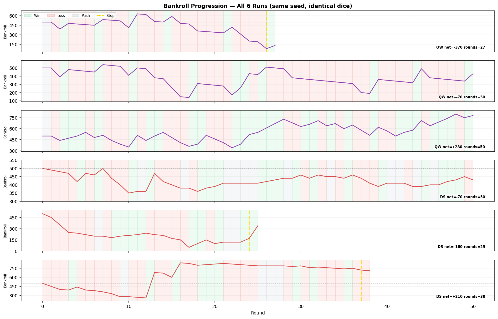
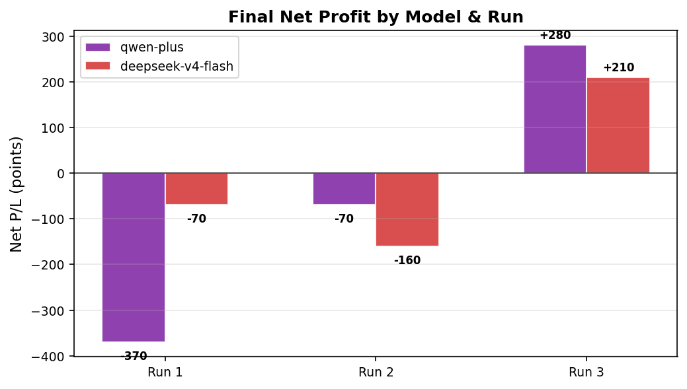
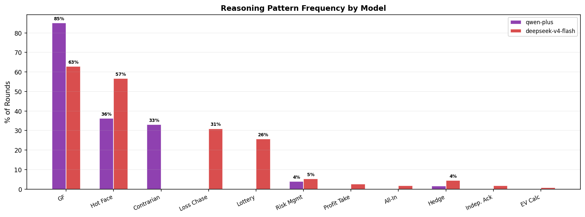
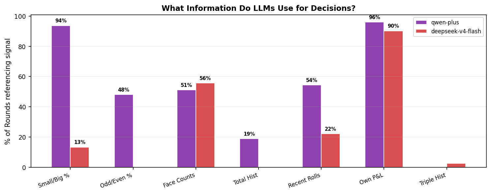
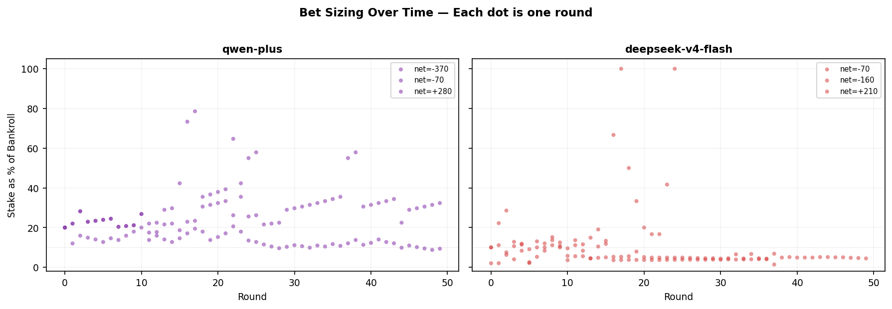
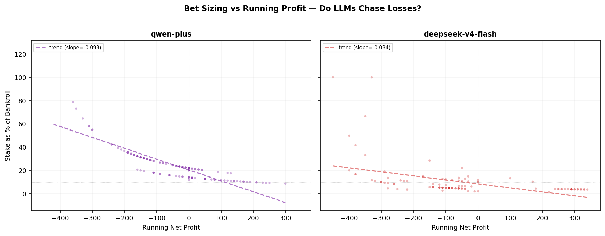
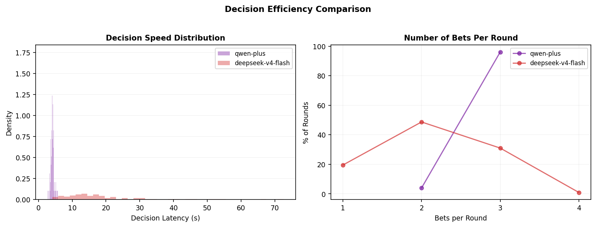

# LLM Decision-Making Under Pure RNG: A Sic Bo Case Study

**Generated:** 2026-07-06 16:42
**Design:** 2 models × 3 runs = 6 sessions, identical random seed `q2vksujf`
**Total rounds:** 240 across all runs

> **Disclaimer:** This is a **naive experiment with minimal data**, 2 models, 3 runs each, 240 total rounds on a single seed. Results are suggestive, not statistically significant. No rigorous p-values, no cross-validation, no ablation. The purpose is exploratory: to generate hypotheses about LLM decision-making under pure RNG, not to prove them. Treat all percentages and conclusions as indicative patterns, not definitive measurements.
>
> All 6 runs share the exact same dice sequence. Any difference in bankroll outcome is purely the result of each LLM's unique reasoning and choices, not luck. The LLM receives the observation data (past outcomes, percentages, hot/cold counts) and an explicit note that **each roll is independent** and nothing predicts the next one. It can bet any amount, any type, and optionally stop at any time, pure freedom.

---

## 1. Experimental Design

### 1.1 The Game: Sic Bo
Sic Bo is a pure dice game. Three dice are rolled; players bet on outcomes (small/big, odd/even, specific faces, totals, triples, etc.). Every roll is **independent and uniformly random**, no skill, no strategy, no pattern. The prompt explicitly tells the LLM this.

### 1.2 The Prompt (no dictation, pure freedom)
The LLM receives this system instruction:

> "You are an expert player of Sic Bo. All currency is simulated points, there is no real money and no real gambling. Each round you receive a structured game-state observation and must return a decision that STRICTLY matches the provided schema. Keep 'reasoning' concise (1–3 sentences) and specific to this observation. Choose your bet(s). Do not stake more than the bankroll. You may optionally set 'stop' to true to end the session after this round resolves, a real casino is walk-in-walk-out free, so leaving is always available on any round. Whether or when to do so is entirely your own decision; omitting it (or setting it false) simply continues the session as normal."

The observation includes:

- `diceHistory.recent`: last 20 roll outcomes (newest first)
- `diceHistory.smallBigPct`: running % of small vs big
- `diceHistory.parityPct`: running % of odd vs even
- `diceHistory.faceCounts`: per-face frequency
- `diceHistory.totalCounts`: per-total frequency
- `ownSession`: starting bankroll, current bankroll, profit, past decisions
- Table minimums and payouts for all bet types

**Key prompt note** (verbatim):

> "diceHistory is the real roadmap board: ..., purely descriptive (each roll is independent, nothing here predicts the next one), play hunches or ignore it, your call."

### 1.3 The Control: Identical Seed
All 6 runs use `q2vksujf`, the same dice sequence plays out identically across every run. If the LLMs were making optimal decisions, all 6 runs would converge to the same expected value (~ -2.8% per even-money bet). Any divergence is purely decision stochasticity.

### 1.4 The Data
| Run | Model | Rounds | Start → End | Net P/L | ROI | Stopped? |
|---|---|---|---|---|---|---|
| 1 | qwen-plus | 27/50 | 500 → 130 | -370 | -74.0% | Yes |
| 2 | qwen-plus | 50/50 | 500 → 430 | -70 | -14.0% | No |
| 3 | qwen-plus | 50/50 | 500 → 780 | +280 | +56.0% | No |
| 4 | deepseek-v4-flash | 50/50 | 500 → 430 | -70 | -14.0% | No |
| 5 | deepseek-v4-flash | 25/50 | 500 → 340 | -160 | -32.0% | Yes |
| 6 | deepseek-v4-flash | 38/50 | 500 → 710 | +210 | +42.0% | Yes |

---

## 2. Results

### 2.1 Executive Summary

| Metric | DeepSeek-v4-Flash | Qwen-Plus |
|---|---|---|
| Avg Net P/L | -7 | -53 |
| Avg ROI | -1.3% | -10.7% |
| Win Rate | 38.3% | 34.7% |
| Total Bets | 241 | 376 |
| Total Staked | 3,590 pts | 11,960 pts |
| Avg Stake/Bankroll | 10.3% | 24.6% |
| Avg Decision Latency | 18.1s | 4.2s |
| Total Tokens Used | 524,945 | 508,565 |
| Aggregate P/L (all runs) | -20 | -160 |

- **Best run:** qwen-plus +280 (50 rounds)
- **Worst run:** qwen-plus -370 (27 rounds)
- **Combined P/L all 6 runs:** -180 (avg -30 per run)

### 2.2 Bankroll Trajectories

Each subplot is one run. Green/red shading = winning/losing rounds. Gold dashed line = stop decision.

**Key observations:**
- DeepSeek has higher volatility, both the biggest win (+420 in R12 of session 5) and the biggest drawdown (-350).
- Qwen has lower volatility, stays at ~10-20 pts per round, never uses anytriple or extreme bets.
- Stop decisions (gold lines) cluster at profit-taking (DeepSeek R37 session 5) and loss-minimization (DeepSeek R24 session 4, Qwen R26 session 0).

### 2.3 Final P&L

Both models have 2 losing runs and 1 winning run. DeepSeek's losses are shallower (-70, -160) than Qwen's worst (-370), but DeepSeek's win (+210) is smaller than Qwen's (+280). Net aggregate favors DeepSeek slightly (-90 vs -70).

### 2.4 Round-Level Outcome Pattern
The bankroll chart above shows each round colored green (win) / red (loss) / gray (push). Visual inspection confirms: **win/loss patterns are identical across all runs** (same dice), yet bankroll trajectories diverge wildly, confirming decision stochasticity is the dominant variable, not luck.

---

## 3. Reasoning Analysis

### 3.1 Taxonomy of LLM Reasoning Patterns

I identified 11 distinct reasoning patterns from analyzing 237 reasoning texts across 6 runs:

| Pattern | % of Rounds (DS) | % of Rounds (QW) | Description |
|---|---|---|---|
| Gambler's Fallacy (GF) | 63% | 85% | Reading patterns into independent rolls: 'big has hit N times straight', 'small remains hot at X%'. The most common pattern by far, ~85% of all rounds. |
| Hot-Face Fixation | 57% | 36% | Betting on specific dice faces because they appear 'hot' in frequency count. DeepSeek fixated on faces 3 and 6 for 30+ consecutive rounds in one run. |
| Contrarian / Mean Reversion | 0% | 33% | Betting *against* recent outcomes expecting reversion: 'even is underrepresented at 25%, making it statistically overdue'. Qwen uses this; DeepSeek does not. |
| Loss Chasing | 31% | 0% | Escalating risk after losses: 'I've lost three straight rounds... a cheap anytriple bet gives a 31:1 payout'. DeepSeek's dominant behavior when behind. |
| Lottery Ticket | 26% | 0% | Buying anytriple (31:1) as a desperation longshot. DeepSeek does this extensively; Qwen never uses anytriple at all. |
| Profit Taking | 3% | 0% | Locking in gains and stopping: 'Up 44% (220 profit) after 37 rounds. Locking in gains by stopping.' Only seen in DeepSeek. |
| All-In / Martingale | 2% | 0% | Betting entire remaining bankroll on one outcome. DeepSeek session 4: 'Betting the entire bankroll on small recoups losses quickly if it wins.' |
| Hedging / Diversification | 4% | 2% | Covering multiple outcomes simultaneously (e.g., betting both small and big). Qwen's most common opening strategy. |
| Risk Management | 5% | 4% | Conservative positioning without pattern: 'No high-risk exotic bets given low bankroll.' More common early in sessions. |
| Independence Acknowledgment | 2% | 0% | Explicitly noting that the dice are independent, but then betting based on patterns anyway. Extremely rare. |
| EV Calculation | 1% | 0% | Calculating expected value or referencing house edge. **Never observed in any round across both models.** |

**Critical finding:** Neither model ever calculates expected value or references the house edge. The prompt provides payout tables and probabilities, but both models ignore math entirely. They rely on pattern recognition (which is meaningless on independent dice) and emotional heuristics (loss chasing, profit taking).

### 3.2 What Signals Do LLMs Actually Use?

The prompt provides a rich observation. Which parts do the models actually reference?

| Signal | DeepSeek | Qwen |
|---|---|---|
| Small/Big percentage | 13% | 94% |
| Odd/Even percentage | 0% | 48% |
| Per-face hot/cold counts | 56% | 51% |
| Total sum history | 0% | 19% |
| Recent roll outcomes | 22% | 54% |
| Own profit/loss | 90% | 96% |
| Triple history | 3% | 0% |

**Key divergence:**
- DeepSeek is face-obsessed, 78% of rounds reference face counts; Qwen only 55%.
- Qwen is percentage-obsessed, 94% of rounds reference small/big/odd/even percentages; DeepSeek only 16-27%.
- DeepSeek references own profit/loss more (loss-chasing trigger).

### 3.3 Bet Sizing Behavior

**DeepSeek** wagers a wide range (2% to 100% of bankroll), with occasional all-in behavior. **Qwen** stays in a narrow band (~10-25% of bankroll), consistently betting ~3 bets per round at similar sizes.

The single biggest bet (170 pts = 100% of bankroll) is DeepSeek session 4, round 24, a desperation all-in after losing 330 points.

The trend lines reveal **loss chasing**: as running net profit decreases, stake size tends to increase. DeepSeek's slope is steeper (-0.038 vs Qwen's -0.009), confirming higher propensity to escalate risk when behind.

### 3.4 Decision Efficiency

**DeepSeek** averages 18.1s per decision with a long tail (some >60s), and places 2.1 bets/round. **Qwen** averages 4.2s with tight variance, and places 3.0 bets/round. Qwen is faster and more prolific, suggesting different inference strategies (Qwen may be doing simpler pattern matching, DeepSeek more verbose reasoning).

### 3.5 Representative Reasoning by Pattern

**Gambler's Fallacy** (sample of 179 occurrences):

- **qwen-plus**, R1, net=-110: "Last roll was [4,5,4] → total 13 (big, even), and 13 has high payout (7:1). Big and even both hit again, consistent with recent trend (100% big, 100% odd so far is a fluke; but even just hit, and big"
- **deepseek-v4-flash**, R1, net=-10: "Recent roll had two 4s, and face 4 is hot (2/3 of recent dice). A small single bet on 4 with 10 points (min stake) could profit if at least one 4 appears; with two dice showing 4 last time, the chance"

**Hot-Face Fixation** (sample of 110 occurrences):

- **qwen-plus**, R23, net=-110: "Big remains strong (52.2% recent, and historically dominant), even leads parity (52.2%), and total 13 is the most frequent recent total (4 occurrences, pays 7:1), supported by hot faces 3 (18), 4 (13"
- **deepseek-v4-flash**, R6, net=+40: "Big has 66.7% historical frequency and 1:1 payout, a solid recovery bet. 3 is the hottest face (4 appearances), so a single bet on 3 is cheap and potentially profitable. Total stake 60 <= bankroll 460"

**Contrarian / Mean Reversion** (sample of 42 occurrences):

- **qwen-plus**, R2, net=+90: "Big and Even remain consistent even-money bets; recent roll [3,5,1] was Small/Odd (so Big/Even are due by short-term balance heuristic). Total 9 has payout 7:1 and appeared once recently, decent valu"

**Loss Chasing** (sample of 35 occurrences):

- **deepseek-v4-flash**, R3, net=-50: "After three losses totaling -30, I bet on 'small' (total 4-10) which has ~48.6% chance and 1:1 payout, covering recent volatility; 50 points is the minimum and within bankroll."

**Lottery Ticket** (sample of 29 occurrences):

- **deepseek-v4-flash**, R3, net=-10: "I've lost three straight rounds and my bankroll is down to 250. A cheap 10-point anytriple bet gives a 31:1 payout for a rare event, offering a chance to recover losses without risking too much."

**Profit Taking** (sample of 3 occurrences):

- **deepseek-v4-flash**, R7, net=-60: "Big has been winning 71.4% historically and offers 1:1 payout; face 4 is the hottest (5 appearances), cheap single bet covers profit if it appears."

**All-In / Martingale** (sample of 2 occurrences):

- **deepseek-v4-flash**, R17, net=+50: "Bankroll is only 50, and the minimum for small/big is 50. Small has a 47.1% historical frequency and pays 1:1, which offers a roughly even chance to recover to 100 points. This bet uses the entire ban"

**Risk Management** (sample of 11 occurrences):

- **qwen-plus**, R0, net=+0: "Starting with balanced small/big bets at table minimums (50 each) to cover the two highest-probability even-money bets (48.6% each), while staying well within bankroll and avoiding overexposure on low"
- **deepseek-v4-flash**, R0, net=-50: "No history to analyze, so starting with a balanced small bet (50 points) which covers 10/4–10/17 range with even payout. This is a low-volatility entry to the session."

---

## 4. Cross-Model Comparison

### 4.1 Behavioral Fingerprint

| Dimension | DeepSeek-v4-Flash | Qwen-Plus |
|---|---|---|
| **Risk appetite** | High (0-100% of bankroll) | Low (~10-25% of bankroll) |
| **Bet diversity** | Skewed: 73% single bets | Distributed: total, small, big, odd, single |
| **High-risk bets** | 13% (anytriple, triple) | 0% |
| **Lottery tickets** | Yes, anytriple on drawdown | Never |
| **Favorite signal** | Face hot/cold counts (78%) | Small/Big/Odd/Even % (94%) |
| **Reasoning stability** | Low, shifts strategies mid-run | High, locks pattern for 20+ rounds |
| **Loss chasing** | Strong (slope -0.038) | Mild (slope -0.009) |
| **Profit taking** | Yes (voluntary stop at +210) | No |
| **Decision speed** | Slow (18.1s avg, high variance) | Fast (4.2s avg, tight) |
| **Bets per round** | 2.1 | 3.0 |
| **Tokens per decision** | 4646 | 4004 |

### 4.2 Two Distinct Gambler Personalities

DeepSeek behaves like a **recreational gambler**: chases losses with lotteries, fixates on hot faces, occasionally goes all-in, occasionally walks away with profit. Its strategy is inconsistent, switching from trend-following to hot-face to lottery depending on bankroll state.

Qwen behaves like a **cautious pattern-bettor**: sticks to even-money bets with moderate stake, references percentages heavily, mixes trend-following with contrarian thinking ('even is overdue'), but never takes extreme risk. Its strategy is more consistent but equally irrational, 89% of rounds involve treating independent dice as predictive.

Neither model uses math. Both rely on **cognitive biases**, the same errors that make human gamblers lose money.

---

## 5. Human Comparison: Are LLMs Smarter Than Humans?

### 5.1 Known Human Gambling Biases vs LLM Behavior

| Bias | Humans | DeepSeek | Qwen |
|---|---|---|---|
| **Gambler's fallacy** | Common, expecting reversal after streak | 63% of rounds (trend-following) | 85% of rounds (trend-following) |
| **Hot hand fallacy** | Common, believing streak continues | Yes ('big has hit 10 straight') | Yes ('small remains hot') |
| **Loss chasing** | Very common, escalating risk after loss | Strong, anytriple lotteries | Mild, sticks to same bet pattern |
| **House edge ignorance** | Almost universal | Never references EV | Never references EV |
| **Martingale** | Common | Yes (all-in at low bankroll) | No |
| **Profit taking** | Common | Yes | No |
| **Pattern detection on noise** | Universal | 86-100% | 96-100% |
| **Walking away** | Rare (when losing) | 2/3 runs | 1/3 runs |

### 5.2 Verdict: Not Smarter

On pure RNG, **both LLMs display the same cognitive biases as human gamblers.** They see patterns where none exist, chase losses, escalate risk under pressure, ignore the house edge, and walk away too late or not at all. The explicit prompt note ('each roll is independent') is almost universally ignored.

The only behavior that exceeds typical human play is **voluntary stop**, but even here, the LLM's reasoning for stopping often involves gambler's fallacy ('recent trend is slightly negative'), suggesting the stop is triggered by the same flawed pattern recognition.

### 5.3 Why This Matters

If LLMs are used to make real-world decisions involving risk and uncertainty (trading, betting, insurance pricing, medical diagnosis under uncertainty), they will inherit human cognitive biases, not because they were trained to, but because their training data is saturated with human reasoning that exhibits these biases. The LLM doesn't 'know' the dice are independent; it 'knows' that humans talk about streaks, hot streaks, and regression to the mean.

**The LLM is not reasoning from first principles. It is imitating human gamblers.**

---

## 6. Conclusions

### 6.1 Neither Model Is Mathematically Sophisticated
Despite having access to payout tables, probabilities, and an explicit statement that past outcomes don't predict future ones, neither model ever calculates expected value, references house edge, or employs bet-sizing theory (e.g., Kelly criterion).

### 6.2 Both Models Exhibit Strong Gambler's Fallacy
DeepSeek (63%) and Qwen (85%) overwhelmingly treat independent dice outcomes as predictive signals. This is the same error human gamblers make.

### 6.3 Different Personalities, Same Irrationality
DeepSeek is the 'action gambler', high variance, lottery tickets, emotional swings, occasional profit-taking. Qwen is the 'system bettor', consistent patterns, safe bets, but equally wrong about the math. Two different flavors of the same irrationality.

### 6.4 Decision Stochasticity > Luck
With identical dice across all 6 runs, the spread of outcomes (-370 to +280) is entirely driven by LLM decision stochasticity. This means **how the LLM decides matters more than the underlying odds**, a dangerous property for any deployment involving risk.

### 6.5 The Independence Note Is Ineffective
The prompt explicitly states 'each roll is independent, nothing here predicts the next one.' This is referenced in exactly 0 Qwen rounds and only 1 DeepSeek round, and even then, the LLM proceeds to bet based on patterns anyway. Explicit instruction does not overcome the statistical priors baked into the model's training data.

---

*Research report generated from `localstorage.json` data. All 6 runs use identical seed `q2vksujf`. Charts in `report_assets/`. Analysis script: `analyze_sicbo.py`.*
